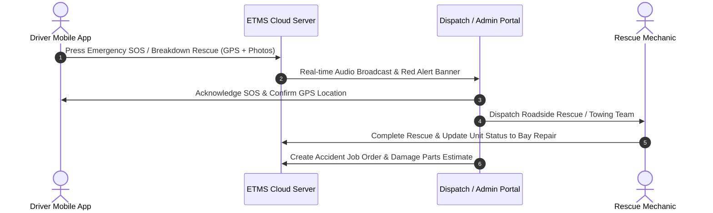

# EURO TAXI MANAGEMENT SYSTEM (ETMS)
## Comprehensive End-to-End Enterprise User & Operations Manual
**Document Version:** 3.0.0 (Enterprise Edition)  
**System URL:** `https://eurotaxisystem.site`  
**Target Audience:** Super Admins (Owners), Fleet Managers, Dispatchers, Cashiers, Workshop Mechanics, and Fleet Drivers.

---

# Table of Contents
1. [Executive Summary & System Architecture](#1-executive-summary--system-architecture)
2. [User Roles, Permissions & Security Protocols](#2-user-roles-permissions--security-protocols)
3. [Authentication, MFA & Account Management](#3-authentication-mfa--account-management)
4. [Live Dashboard & Fleet Telemetry](#4-live-dashboard--fleet-telemetry)
5. [Fleet & Unit Management](#5-fleet--unit-management)
6. [Boundary & Daily Financial Collection](#6-boundary--daily-financial-collection)
7. [Driver Management, KYC & Debt Ledger](#7-driver-management-kyc--debt-ledger)
8. [GPS Live Tracking & Remote Engine Immobilizer](#8-gps-live-tracking--remote-engine-immobilizer)
9. [Vehicle Maintenance & Workshop Job Orders](#9-vehicle-maintenance--workshop-job-orders)
10. [Inventory, Spare Parts & Supplier Management](#10-inventory-spare-parts--supplier-management)
11. [Number Coding Management (UVVRP)](#11-number-coding-management-uvvrp)
12. [Driver Behavior, Incidents & Accident SOS Lifecycle](#12-driver-behavior-incidents--accident-sos-lifecycle)
13. [Unit Profitability & AI Decision Support System (AI-DSS)](#13-unit-profitability--ai-decision-support-system-ai-dss)
14. [Office Expenses & Financial Approvals](#14-office-expenses--financial-approvals)
15. [Staff Records & Payroll / Salary Management](#15-staff-records--payroll--salary-management)
16. [Franchise Case & LTFRB Compliance](#16-franchise-case--ltfrb-compliance)
17. [Support Center, Internal Chat & Announcements](#17-support-center-internal-chat--announcements)
18. [Super Admin & System Security Control](#18-super-admin--system-security-control)
19. [Archive & Disaster Recovery Management](#19-archive--disaster-recovery-management)
20. [Mobile Driver Application Guide](#20-mobile-driver-application-guide)
21. [Standard Operating Procedures (SOP) & Troubleshooting](#21-standard-operating-procedures-sop--troubleshooting)

---

## 1. Executive Summary & System Architecture

The **Euro Taxi Management System (ETMS)** is a cloud-based, mission-critical Enterprise Resource Planning (ERP) and Fleet Telematics platform engineered specifically for modern taxi fleet operators.

### Key Capabilities:
- **Real-Time Fleet Telemetry:** Live GPS map, speed monitoring, and remote engine shut-off via IoT protocols.
- **Financial Integrity:** Automated boundary tracking, dynamic boundary rate calculation, debt ledger with installment management, and automated net profitability metrics.
- **Maintenance & Inventory:** Job order workflows, parts deduction, supplier catalogs, and preventive maintenance triggers.
- **Safety & Incident Response:** Emergency SOS broadcast, real-time audio chimes, photo-documented accident reporting, and driver incentive/penalty scoring.
- **AI Decision Support (AI-DSS):** Automated recommendations powered by Google Gemini to identify underperforming units, optimize maintenance intervals, and maximize fleet ROI.

---

## 2. User Roles, Permissions & Security Protocols

ETMS enforces a strict **Role-Based Access Control (RBAC)** model combined with **Granular Page-Level Permissions**.

| Role | Access Level | Description & Core Responsibilities |
| :--- | :--- | :--- |
| **Super Admin / Owner** | Full System Access | Complete administrative authority. Manages user approvals, assigns page access matrices, edits custom roles, configures system security passwords, and accesses audit logs. |
| **Admin / Fleet Manager** | Management Access | Manages fleet units, schedules maintenance, monitors driver behaviors, oversees boundary accounts, and generates analytics. |
| **Dispatcher / Operations** | Operations Access | Monitors Live GPS tracking, handles emergency SOS alerts, manages vehicle coding rotations, and coordinates roadside rescue. |
| **Cashier / Finance** | Financial Access | Records daily boundary remittances, manages driver debt repayments, logs office expenses, and processes staff payroll. |
| **Mechanic / Workshop Staff** | Inventory & Maintenance | Updates job order statuses, logs replaced spare parts, and monitors workshop inventory. |
| **Taxi Driver** | Mobile App Access | Remits boundary, views debt and earnings history, triggers emergency SOS / rescue, submits accident reports, and contacts support. |

---

## 3. Authentication, MFA & Account Management

### 3.1 Two-Factor Authentication (2FA / OTP)
1. **Login Credentials:** Enter registered Email/Username and Password at `/login`.
2. **Device Verification:** If logging in from an unrecognized device or browser, a 6-digit One-Time PIN (OTP) is automatically generated and dispatched via SMS (via Semaphore API) and/or verified Email.
3. **Session Persistence:** Verified devices are securely recorded in the `verified_browsers` ledger.

### 3.2 Forced Password Change
- Users provisioned with temporary system passwords will be automatically redirected to `/force-change-password` upon initial login. The system requires a secure password with a minimum of 8 characters, alphanumeric mix, and special symbols.

### 3.3 My Account Management (`/my-account`)
- **Profile Customization:** Update full name, contact number, address, and profile photo.
- **Email Verification:** Requesting an email change triggers a secure cryptographic verification link sent to the new email address.
- **Web Push Notifications:** Enable browser push alerts for instant sound chimes and system broadcasts.

---

## 4. Live Dashboard & Fleet Telemetry (`/`)

The Dashboard is the operational nerve center of ETMS, updating continuously via real-time asynchronous polling.

### Key Metrics & Widgets:
1. **Fleet Status Counter Cards:**
   - **Total Fleet:** Total registered units.
   - **Active On-Road:** Vehicles currently operating without active restrictions.
   - **In Maintenance:** Units currently assigned to the repair bay.
   - **Coding Today:** Vehicles restricted by the Unified Vehicular Volume Reduction Program (UVVRP).
   - **Flagged / Impounded:** Units with operational holds or unpaid critical debts.
2. **Real-Time Financial Overview:**
   - **Today's Boundary Collection:** Live progress bar showing Target vs. Actual Remittances.
   - **Net Profitability Snapshot:** Daily Gross Revenue minus Maintenance, Fuel, and Operational Expenses.
3. **Emergency Alert Banner:**
   - Instant visual and audio alert when a driver triggers an SOS or submits an urgent accident report.
4. **Quick Action Floating Dock:** One-click modals to quickly record boundary, create a maintenance ticket, flag a vehicle, or broadcast an announcement.

---

## 5. Fleet & Unit Management (`/units`)

### 5.1 Adding a New Vehicle
1. Navigate to **Units** > Click **"+ Add New Unit"**.
2. Fill in the required technical details:
   - **Plate Number** & **Body / Taxi Number** (Must be unique).
   - **Engine Number**, **Chassis / VIN Number**, and **LTFRB Franchise Number**.
   - **Make / Model / Year** (e.g., Toyota Vios 2023).
   - **Coding Day** (Automatically assigned based on the last digit of the plate number, or custom selected).
   - **GPS Device IMEI / Tracker ID** (For telematics sync).
3. Click **"Save Vehicle"**.

### 5.2 Unit Health Score & Statuses
- **Health Score (0 - 100%):** Calculated based on maintenance frequency, incident involvement, mileage wear, and age.
- **Statuses:**
  - `Active` — Vehicle is roadworthy and assigned to active shifts.
  - `In Maintenance` — Vehicle is in the repair workshop.
  - `Flagged / Impounded` — Vehicle is banned from dispatch due to severe violation or unpaid arrears.
- **Health Reset / Recovery:** Authorized managers can execute `/units/{id}/reset-health` after complete vehicle overhaul.

### 5.3 Exporting & Printing
- Click **"Print Fleet Inventory"** (`/units/print`) to generate a formatted printable report of all active vehicles, franchise expiry dates, and health standings.

---

## 6. Boundary & Daily Financial Collection (`/boundaries`)

### 6.1 Recording Daily Boundary
1. Navigate to **Boundaries** > Click **"Record Collection"**.
2. Select **Vehicle Body No.** and **Assigned Driver**.
3. The system automatically computes the **Expected Boundary Rate** based on active Boundary Rules (e.g., standard day, weekend, holiday, or coding discount).
4. Enter **Actual Amount Paid**:
   - **Exact Payment:** Recorded as `Settled`.
   - **Shortage (Underpayment):** Difference is automatically logged to the driver's **Debt Ledger**.
   - **Excess (Overpayment):** Credited toward existing driver debts or advance balance.
5. Click **"Submit & Issue Receipt"**.

### 6.2 Dynamic Boundary Rules (`/boundary-rules`)
- Configure standard 24-Hour Shift vs 12-Hour Shift rates.
- Set special discounted rates during vehicle coding days or bad-weather holidays.

---

## 7. Driver Management, KYC & Debt Ledger (`/driver-management`)

### 7.1 Driver Onboarding & KYC Documentation
1. Navigate to **Driver Management** > Click **"+ Register Driver"**.
2. Input personal identification: Full Name, Contact Number, Address, Emergency Contact, and Driver's License Number with Expiry Date.
3. Upload verified digital KYC files:
   - Professional Driver's License (Front & Back)
   - NBI Clearance
   - Police Clearance
   - Medical Certificate & Drug Test Result
4. Click **"Save Driver Record"**.

### 7.2 Terms & Conditions Upload (`/driver-management/terms`)
- Admins can upload official signed contracts and company rulebook images (`/driver-management/terms/upload`) which drivers can review and acknowledge directly in their mobile app.

### 7.3 Driver Debt & Installment Plans (`/driver-management/debts`)
- **Accumulated Shortages:** When a driver falls short on daily boundary or incurs vehicle damage repair charges, a debt item is created.
- **Installment Terms:** Cashiers can establish structured daily installment deductions (e.g., +₱150 per shift) until arrears are fully amortized.
- **Debt Settlement (`/driver-management/pay-debt`):** Record ad-hoc cash payments against specific debt IDs.

### 7.4 Suspension & Banning Protocol
- **Temporary Suspension:** Restricts driver app access for a set number of days (e.g., 3-day suspension for late boundary).
- **Permanent Ban:** Drivers with critical safety offenses, boundary absconding, or fraudulent conduct can be permanently banned (`/driver-management/{id}/suspend-or-ban`), preventing dispatch across the fleet.

---

## 8. GPS Live Tracking & Remote Engine Immobilizer (`/live-tracking`)

### 8.1 Real-Time Map & Telematics
- The interactive map displays all registered units color-coded by operational status:
  - 🟢 **Green:** Moving / Engine On (ACC On).
  - 🟡 **Yellow:** Idle / Engine Running (0 km/h).
  - 🔴 **Red:** Parked / Engine Off (ACC Off).
  - 🟣 **Purple / Flashing:** SOS Alert / Rescue Requested.
- Clicking any vehicle pin reveals live speed (km/h), odometer mileage, GPS satellite signal strength, battery voltage, and current driver name.

### 8.2 Remote Engine Immobilizer (Anti-Theft / Emergency Kill)
1. In the Live Tracking panel, select the target unit.
2. Click **"Engine Control"** (`/live-tracking/engine-control`).
3. Select Command:
   - **`Cut Off Engine (Kill Ignition)`** — Sends an immediate digital relay command to cut fuel delivery / ignition.
   - **`Restore Engine (Re-enable Ignition)`** — Restores fuel relay circuit to normal state.
4. **Safety Protocol:** Engine kill commands prompt for admin confirmation to avoid accidental activation while a vehicle is travelling at high speed.

---

## 9. Vehicle Maintenance & Workshop Job Orders (`/maintenance`)

### 9.1 Creating a Maintenance Ticket
1. Navigate to **Maintenance** > Click **"+ New Job Order"**.
2. Select **Vehicle Body No.** and select **Maintenance Type**:
   - `Preventive Maintenance Schedule (PMS)` (e.g., 5,000 km Oil Change)
   - `Mechanical Repair` (Brakes, Clutch, Suspension, Engine)
   - `Electrical Repair` (Alternator, Battery, Lighting, GPS Tracker)
   - `Body & Paint / Accident Repair`
3. Enter **Odometer Reading**, **Priority Level** (`Low`, `Medium`, `High`, `Urgent`), and **Issue Description**.
4. Assign Workshop Mechanic.
5. Click **"Create Job Order"**.

### 9.2 Workshop Workflow & Parts Deduction
1. **In Progress (`/maintenance/{id}/toggle-in-progress`):** Marks the unit as actively being serviced in the repair bay.
2. **Adding Spare Parts (`/maintenance/{id}/parts`):** Select spare parts used from inventory. The system automatically reduces stock on hand and tallies the total parts cost.
3. **Completion (`/maintenance/{id}/toggle-complete`):** Logs labor cost, final remarks, and automatically updates the vehicle's Health Score back to optimal standing while setting the unit status back to `Active`.

---

## 10. Inventory, Spare Parts & Supplier Management (`/inventory-management`)

### 10.1 Spare Parts Catalog (`/spare-parts`)
- Manage vehicle replacement inventory: Engine Oil, Brake Pads, Oil Filters, Tires, Spark Plugs, Belts, and Headlight Bulbs.
- Track **Part SKU**, **Category**, **Unit Purchase Price**, **Selling/Charge Price**, and **Current Quantity on Hand**.
- **Reorder Point Trigger:** When stock levels drop below the defined minimum safety threshold, the system displays an orange low-stock alert.

### 10.2 Supplier Management (`/suppliers`)
- Maintain a directory of accredited automotive parts suppliers, contact persons, telephone numbers, and terms of credit.

---

## 11. Number Coding Management (UVVRP) (`/coding`)

### 11.1 Metro Manila UVVRP Scheme Matrix
The system automatically maps license plate endings to restriction days:
- **Monday:** Plates ending in `1` and `2`
- **Tuesday:** Plates ending in `3` and `4`
- **Wednesday:** Plates ending in `5` and `6`
- **Thursday:** Plates ending in `7` and `8`
- **Friday:** Plates ending in `9` and `0`

### 11.2 Daily Coding Automation
- Every morning at 05:00 AM, the automated cron job flags all restricted vehicles as `Coding Today`.
- Automated SMS and mobile app push notifications are sent to drivers assigned to coding vehicles.
- Fleet dispatchers can review alternate non-coding vehicle swaps in the **Coding Suggestions** panel (`/coding/suggestions`).

---

## 12. Driver Behavior, Incidents & Accident SOS Lifecycle (`/driver-behavior`)

### 12.1 Incident Classifications & Logging
- **Minor Violations:** Customer discourtesy, improper uniform, meter refusal.
- **Moderate Violations:** Boundary evasion, unapproved route deviation, reckless speeding.
- **Major Violations / Accidents:** Vehicle collision, hit-and-run, DUI, criminal liability.
- Admins log incidents with supporting witness statements, police report numbers, and photo attachments.

### 12.2 Accident Emergency SOS & Roadside Rescue Lifecycle


### 12.3 Driver Incentive & Sanctions Program (`/driver-behavior/incentives`)
- Drivers with 30 consecutive days of zero accidents, zero customer complaints, and on-time boundary remittances receive an automated **Clean Record Incentive Bonus**.
- Drivers with repeated violations face points deduction, required retraining, or temporary suspension.

---

## 13. Unit Profitability & AI Decision Support System (AI-DSS) (`/unit-profitability`)

### 13.1 Profitability Matrix & Financial Equation
For every taxi unit, ETMS computes net financial yield across customizable timeframes:
$$\text{Net Profit} = \text{Total Boundary Collected} - (\text{Maintenance Costs} + \text{Spare Parts} + \text{Franchise Fees} + \text{Insurance/Depreciation})$$

### 13.2 AI-DSS Fleet Insights (`/unit-profitability/ai-dss`)
Integrated with Google Gemini AI, the AI Decision Support System analyzes fleet telemetry and financials to produce actionable executive intelligence:
- **Vehicle Retirement / Sale Advice:** Identifies "Lemon" vehicles whose recurring maintenance costs exceed revenue generation.
- **Preventive Maintenance Optimization:** Predicts component failures based on cumulative mileage and driving routes.
- **Driver-Vehicle Synergy:** Recommends optimal vehicle assignments matching high-yield drivers with high-efficiency units.

---

## 14. Office Expenses & Financial Approvals (`/office-expenses`)

### 14.1 Logging an Operational Expense
1. Navigate to **Office Expenses** > Click **"+ Record Expense"**.
2. Select Category: `Office Rent`, `Utilities (Electricity/Water)`, `Internet & Cloud Hosting`, `Legal & Permits`, `Marketing`, or `Miscellaneous`.
3. Input **Amount**, **Date of Expenditure**, **Vendor Name**, and attach **Official Receipt (OR)** image.
4. Click **"Submit for Approval"**.

### 14.2 Multi-Tier Approval Pipeline
- Expenses submitted by cashiers/staff remain in `Pending` status.
- Fleet Managers or Owners can review invoice attachments and click **"Approve"** (`/office-expenses/approve/{id}`) or **"Reject"** with remarks.

---

## 15. Staff Records & Payroll / Salary Management (`/salary` & `/staff`)

### 15.1 Staff Registry
- Maintain master records for office staff: Dispatchers, Cashiers, Mechanics, Admin Officers, and Security Personnel.
- Store employment contracts, emergency contacts, base monthly salary rates, and daily rates.

### 15.2 Salary & Payslip Computation (`/salary/report`)
- Compute semi-monthly / monthly payroll factoring in:
  - Base Salary + Overtime Hours
  - Performance Incentives
  - Deductions (SSS, PhilHealth, Pag-IBIG, Cash Advances / Vale)
- Generate one-click printable payslips and payroll summary sheets.

---

## 16. Franchise Case & LTFRB Compliance (`/franchise`)

- Track LTFRB Certificates of Public Convenience (CPC) and franchise validity dates.
- Automated reminder alerts 60 days, 30 days, and 7 days prior to CPC expiry.
- Maintain case hearing records, franchise extension applications, and inspection compliance records.

---

## 17. Support Center, Internal Chat & Announcements (`/support-center` & `/announcements`)

### 17.1 Real-Time Driver Support Tickets
- Drivers submit support tickets directly from the mobile app regarding meter issues, app glitches, or boundary disputes.
- Dispatchers chat directly with drivers in the **Support Center**, exchange attachments, and resolve tickets.

### 17.2 Internal Staff Chat (`/chat`)
- Secure internal 1-on-1 and group messaging for office personnel.
- Real-time message delivery, emoji reactions, and unread notification counter.

### 17.3 Company Announcements (`/announcements`)
- Publish company-wide bulletins, memo updates, holiday operating schedules, and safety advisories.
- Pinned announcements appear prominently at the top of driver mobile feeds.

---

## 18. Super Admin & System Security Control (`/super-admin`)

*Restricted exclusively to System Owners & Super Administrators.*

### 18.1 User Account Approvals & Status Control
- Review newly registered staff/driver accounts. Click **Approve** or **Reject**.
- Instant **Disable/Enable Switch** (`/super-admin/toggle-disable/{id}`) to immediately revoke login access for resigned or suspended personnel.

### 18.2 Granular Page-Access Control Matrix (`/super-admin/page-access/{id}`)
Super Admins can toggle individual page access rights for every staff member:
- Dashboard, Units, Boundaries, Maintenance, Driver Management, Live Tracking, Coding, Driver Behavior, Office Expenses, Salary, Profitability, Inventory, Archive.

### 18.3 Audit Trail & Login History (`/super-admin/login-history`)
- Real-time logging of user activity: User ID, Timestamp, IP Address, Device Fingerprint, and Action Performed (Create, Edit, Delete, Login, Logout).

---

## 19. Archive & Disaster Recovery Management (`/archive`)

### 19.1 Soft Deletes & The Archive Vault
To prevent catastrophic accidental data loss, all deleted entities (Units, Drivers, Maintenance Tickets, Incidents, Expenses, Spare Parts) are moved to the **Archive Vault** rather than immediately deleted from the SQL database.

### 19.2 Restoration & Permanent Purge
- **Restore (`/archive/restore/{type}/{id}`):** Reinstates the archived record back to its active operational table with zero data loss.
- **Permanent Purge (`/archive/force-delete/{type}/{id}`):** Permanently removes the record from the database. Requires entering the **Master Archive Password** configured by the Super Admin.

---

## 20. Mobile Driver Application Guide

Designed for Android smartphones and tablets (Capacitor / Ionic PWA).

```
 ┌──────────────────────────────────────────────┐
 │             EURO TAXI DRIVER APP             │
 ├──────────────────────────────────────────────┤
 │  [ 🟢 ON DUTY ]        Taxi Unit: TX-1024    │
 │                                              │
 │  💰 Today's Boundary:   ₱1,200 / ₱1,200      │
 │  ⚠️ Total Debt/Arrears: ₱0.00                │
 │  ⭐ Driver Rating:      4.9 / 5.0 (Clean)    │
 ├──────────────────────────────────────────────┤
 │  [ 🚨 EMERGENCY SOS ]    [ 🔧 REQUEST RESCUE] │
 ├──────────────────────────────────────────────┤
 │  • View Shift Ledger & Receipts              │
 │  • Submit Accident Incident Report           │
 │  • View Company Rules & Contract Terms       │
 │  • 24/7 Operations Support Ticket Chat       │
 └──────────────────────────────────────────────┘
```

### Driver Mobile Workflows:
1. **Starting a Shift:** Log in > Verify vehicle body number > Perform pre-trip vehicle checklist > Set status to `On Duty`.
2. **Checking Balance & Boundary:** View live shift remittance status, historical receipts, and remaining installment balances.
3. **Triggering SOS:** Tap and hold the **"EMERGENCY SOS"** button for 3 seconds. Instantly transmits GPS location, activates device microphone/camera, and sounds high-priority alarms at the dispatch console.
4. **Requesting Roadside Rescue:** Tap **"Request Rescue"** > Select issue (Flat Tire, Overheat, Mechanical, Out of Fuel) > Transmit precise GPS coordinates.

---

## 21. Standard Operating Procedures (SOP) & Troubleshooting

### Daily Operational Checklist:
- **05:00 AM (Morning Dispatch):** Review Coding Day vehicle roster. Ensure all coding units are parked or reassigned.
- **12:00 PM (Midday Check):** Monitor Live GPS map for off-route or stationary idling units.
- **06:00 PM - 09:00 PM (Shift Handover & Remittance):** Cashiers process daily boundary remittances, log shortages into debt ledgers, and issue digital receipts.
- **10:00 PM (Workshop Handover):** Mechanics inspect units flagged for PMS or repairs and log used spare parts.

### Frequently Asked Questions (FAQ) & Troubleshooting:
- **Q: A driver cannot log into the mobile app.**  
  *A:* Check if the driver account is approved in `/super-admin`. Ensure the driver is not currently `Suspended` or `Banned` in `/driver-management`.
- **Q: Live GPS map is not updating vehicle position.**  
  *A:* Verify that the GPS Tracker device IMEI is correctly entered in `/units`. Ensure the physical tracker on the vehicle has cellular data and active ignition power.
- **Q: Web push notifications or audio chime is not sounding.**  
  *A:* Ensure browser notification permissions are set to **"Allow"** at `eurotaxisystem.site`. Check that the device volume is unmuted.

---
*End of User Manual. Euro Taxi Management System © 2026. All Rights Reserved.*
